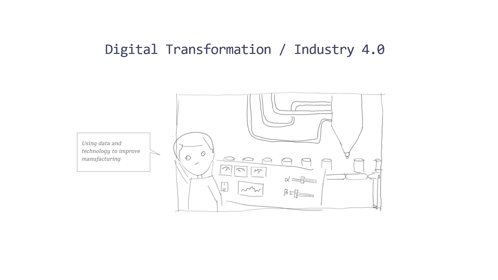
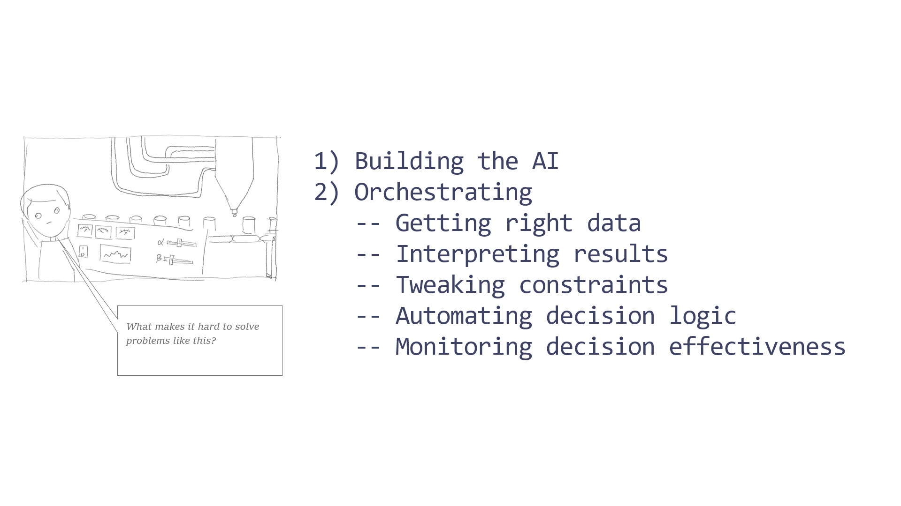

# Project Mycroft

## Goals

This project explores the possibility for allowing business users without any programming experience to compose and run their own automation tasks. 

### Hello World

A software developer can describe a "hello world" problem using a syntax like: 

```
console.log('Hello world')
```
But a business user would more likely to express their need for social interaction with a machine with something along the lines of:

```
say "hello"
```

### Not a chat bot

Chat bots are getting better at requests involving single tasks. This project concerns itself with composing multi-stage tasks like:

```
say "good morning" to me every time I wake up and play some music for me
```

This automation job has multiple elememts to it:

- a trigger
- a sequence of operations
- one or more outputs

Each of them requires some sort of configuration so that the system understands what it means in the user's context

- how does the system know when to do this?
- do they want a good morning push notification or to be greeted in some other way?
- where is this music coming from?
- what criteria should be usef for choosing music, e.g. playlist / radio station / recommendation

The main objective of this project is to explore how business users can choose from, configure and chain together known triggers, operations and outputs in an inuitive way. The examples above use natural langauage to describe the job. It is not neccessary to describe jobs in this way. You can use UI or other even a command line.

### Broader Ecosystem

So far we have only considered the end consumer of the automation service. There is work required by others to setup available triggers, operations and output types and to describe their configuration requirements. The project also explores the how the ecosystem will be enabled, e.g. as a provider or a music service, how could you allow the end consumer to use your music service to play music.

## Background

We will use a real business example to illustrate what Mycroft is all about.



Industry 4.0 started in manufacturing, the the principles of using data and business understanding to improve business processes and enable new styles of doing business is permeating into all industries.


This manufacturing example shows the high level AI and process automation work needed to solve a problem like this.



AI tends to steal the spotlight, but a lot of what it takes to put AI into practice involves human knowledge...not AI.


Traditional coding is one way to to capture human logic...


... but there is lots of knowledge out there in lots of peoples heads, and it is constantly improving. It is not practical to describe it all using traditional coding approaches.


Project Mycroft is a design investigation task aimed at exploring alternative ways to encode human knowledge and use it to automate tasks.


## Project and Deliverables

Fork this repository and produce one or more example use case and and design documentation for:

1) The language or UI that the end user uses to select/configure and compose an automation job
2) Your "SDK" for adding new triggers/operations and outputs. This should include documemtation and samples.
3) A limited working example demostrating aspects of the solution

### Use case demonstration

A demonstration of the main idea of the solutions must show:

1) A business user's experience in creating and setting up an automation job. The user must be able to choose what will trigger the task, choose at least two operations to perform and choose a way to produce some sort of output from the automation.
2) A business user's experience for viewing the results of an automation job.
3) A business user's experience for modifying an automation job. The user must be able to define an intermediate processing task that uses something produced by a previous task.
4) A developer's experience for adding a new trigger, processing task or output task.
5) The business user's experience for swapping out an existing trigger, processing task or output task with the new one added in step 4 above.

### Prereqisites

Pick your own use cases as a subject for your project.

The executable "workers" that carry out runtime automation tasks will be written as python classes. They must inherit from BaseWorker and you must implement the *execute()* method. See sample. The execute method may wrap an external service. The rest of the code can be python and/or javascript and open source libraries instalable via pip or npm.

You provide your own execution environment or run on Amazon Lambda or Google Cloud Functions
All source code needed to demonstrate your example should be present in your repository along with documentation about how to setup and use it.

## Evaluation Criteria

1) Ease of composition. How easy is it for non-technical users to compose multi-sequence tasks?
2) Ease of authoring? How easy is it for developers to contribute new triggers/operation or output types?
3) How broad is the range of configuration and composition options provided?
4) How useful would this be to a real user? Your solution will be somewhat useful to a user if it allows the user to automate something that he/she currently does manually. It will be even more useful if it allows the users to do something that he/she couldn't do at all today.
 
# Mycroft Base Classes

The main Mycroft Base Class is BaseWorker. BaseWorker establishes the basic signature for any objects that perform work as part of task processing.

The Incrementor class below shows how to use BaseWorker to build a simple worker. When executed this worker takes whatever it received as input and increments it by an pre-configured amount.

```
class Incrementor(BaseWorker):

    """
    Simple worker. Increments a number by a value. Value is passed as a parameter called increment.
    """

    def __init__(self, name = None, increment = 1, **kwargs):

        kwargs['increment'] = increment
        super().__init__(name, **kwargs)

    def execute(self, x):
        """
        Execute the worker. The execute method always takes a single argument representing the
        input to the worker.
        """

        return (x + self.increment)
 ```
 
The Incrementor inherits methods for initializing parameters from BaseWorker. The only mandatory method for a worker is the execute() method. All workers take a single input and return a single output. Any other data or metadata that they need for execution should be established at the time of initialization of determined inside the execute() method.
 
Mycroft also has a Pipeline Class that demonstrates one way of composing tasks using Mycoft workers. The example below shows how to compose a Pipeline task using two Incrementors.

```
pipeline = mc.Pipeline(Incrementor('add_two',2),Incrementor('add_three',3))
```

The sample above initiates a Pipeline object that will take the input to the pipeline and run two workers on it. The first worker adds 2 to the input the second worker adds 3.

When executing the above pipeline on using 5 as the input it will return 5 +  + 3 = 10.

```
result = pipeline.execute(5)
print (result)
>>> 10
```

This basic example is not exactly a ground-breaking new way to compose an arithmetic problem, but it serves to demonstrate the idea of composing tasks. The act of composition is really simple. Assign parameters to workers and execute them in sequence. These workers are simple, but imagine that they did something more interesting like scrape data off the web, build and execute SQL queries, merge and transform complex data structures, run ML training or scoring tasks or interact with other services, reconfigure other workers or build and execute other pipelines. With a collection of ingenious, abled-bodied workers, configurable using parameters and composable into a tasks, the sky is the limit in terms of the nature of tasks than can be composed.

With a simple metaphor like the Pipeline above for composing tasks, I am sure you can imagine a UI that allows non-technical users to compose new tasks from existing workers. The creation of new workers still however requires a developer. Now imagine there is a similar simple composition mechanism for the workers themselves. Now the non-technical user is not restricted to only using a predefined set of workers as he/she can assemble new workers from the supplied set of worker components. 
